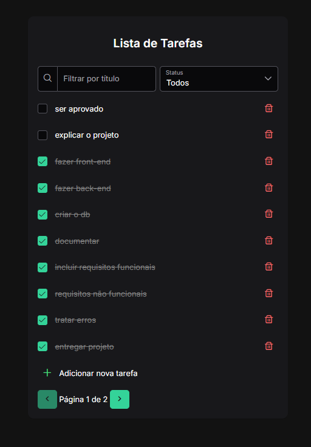

# 📋 To-Do List - Angular + PrimeNG

Aplicação simples de **lista de tarefas** desenvolvida em **Angular**, utilizando **PrimeNG** para os componentes visuais.  
O objetivo do projeto é praticar conceitos de frontend moderno, componentização e integração com backend em **.NET** (em progresso).

## 🚀 Tecnologias

- [Angular](https://angular.io/) 18+
- [PrimeNG](https://primeng.org/) (componentes UI)
- [TypeScript](https://www.typescriptlang.org/)
- [RxJS](https://rxjs.dev/)
- [SCSS](https://sass-lang.com/) / CSS Grid e Flexbox
- [.NET Backend (WIP)](https://dotnet.microsoft.com/)

## 📂 Estrutura do Projeto

```sh

src/
├── app/
│    ├── domain/
│    │    └── todo-list/
│    │         ├── todo-list.ts
│    │         ├── todo-list.html
│    │         ├── todo-list.scss
│    │         └── ...
│    └── app.module.ts
├── assets/
├── environments/
└── main.ts

````

## ⚙️ Como Rodar Localmente

```bash
# Instalar dependências
npm install

# Rodar servidor de desenvolvimento
ng serve

# Acesse no navegador
http://localhost:4200/
````

## ✨ Funcionalidades

- ✅ Adicionar tarefas
- 🗑️ Remover tarefas
- ✏️ Marcar como concluída
- 🔍 Filtrar por título
- 🎯 Filtrar por status (Todos, Completo, Incompleto)
- 📱 Layout responsivo (grid/flex)

## 📸 Prévia



## 📌 Próximos Passos

- 🔗 Integração com backend em .NET
- 💾 Persistência em banco (PostgreSQL)
- 👤 Autenticação de usuários
- 📊 Dashboard de tarefas

---

👨‍💻 Desenvolvido por Rafael Santos
